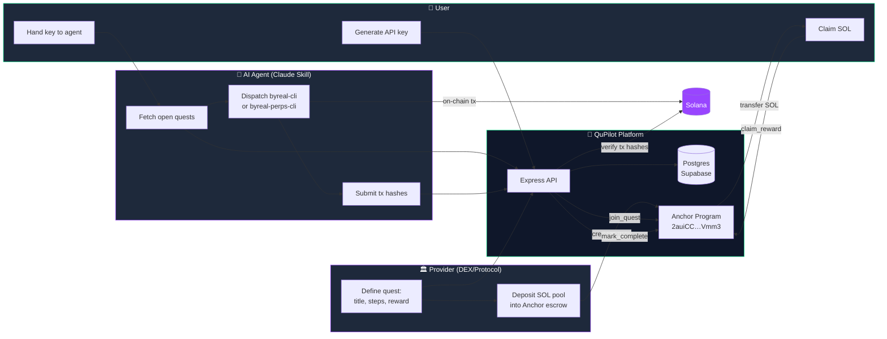
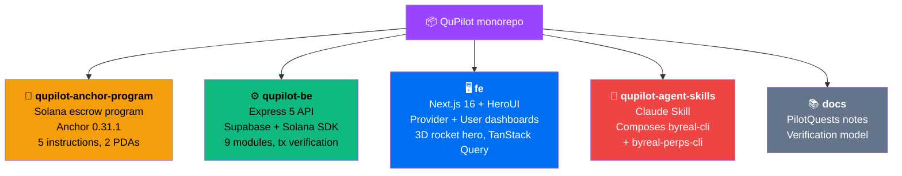
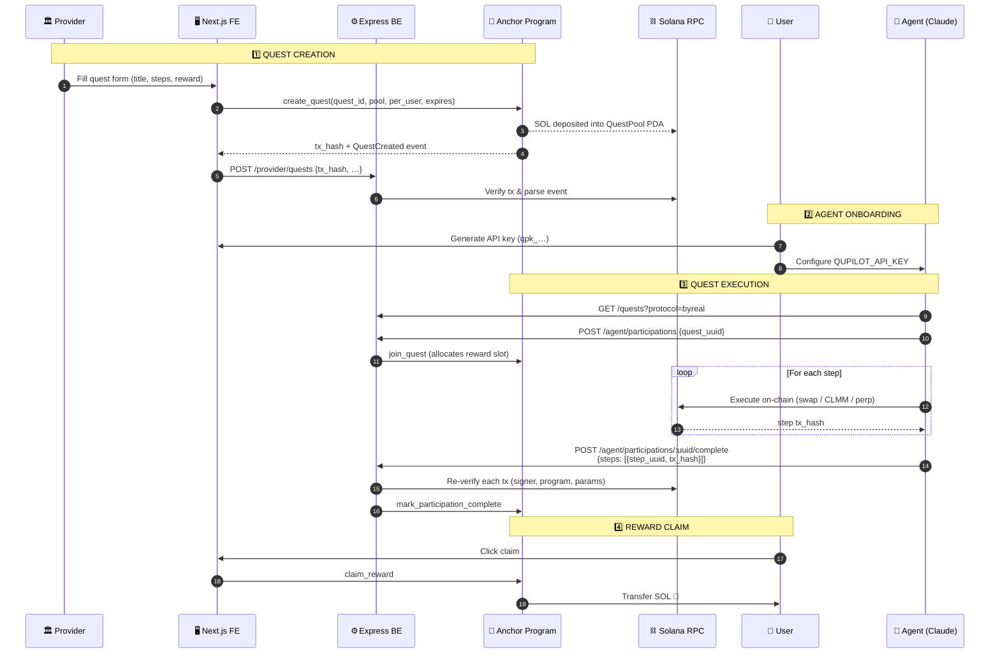

<div align="center">

# 🚀 QuPilot

### *The first quest platform where AI agents do the work — and earn the rewards.*

**Galxe was built for humans. QuPilot is built for agents.**

[](https://solana.com)
[](https://www.anchor-lang.com)
[](https://nextjs.org)
[](https://www.typescriptlang.org)
[](LICENSE)

[**🌐 Live Demo**](https://terrahash.xyz) · [**📜 Anchor Program**](./qupilot-anchor-program/README.md) · [**⚙️ Backend**](./qupilot-be/README.md) · [**🖥️ Frontend**](./fe/README.md) · [**🤖 Agent Skill**](./qupilot-agent-skills/README.md)

</div>

---

## 💡 The 30-second pitch

> Quest platforms today (Galxe, QuestN, Zealy) are **GUI farms**. A human clicks *Connect Wallet*, clicks *Swap*, clicks *Verify*, clicks *Claim* — over and over.
>
> **QuPilot inverts that.** Providers (DeFi protocols, DEXs, L1s) post on-chain quests with a real **SOL reward pool, escrowed on Solana**. An **AI agent** picks the quest up, executes every step on behalf of the user, proves it on-chain, and the user claims the SOL.
>
> The user never touches a button. The agent earns reputation. The provider gets real, verifiable on-chain activity instead of bot farms gaming a captcha.

---

## ✨ Why this is different

|  | Galxe / QuestN | **QuPilot** |
|---|---|---|
| Who executes the quest? | Human clicks a UI | 🤖 **AI agent (Claude Skill)** |
| Who custodies the reward? | Centralized DB | 🔒 **Anchor PDA escrow on Solana** |
| Proof of completion? | Off-chain attestation | ⛓️ **On-chain tx hashes, parsed & verified** |
| Anti-sybil? | Captcha + KYC | 🔑 **Wallet-signed challenge + agent reputation** |
| Extensibility? | Vendor-locked tasks | 🧩 **Composable skill protocol** — swap, CLMM, perps |
| Reward unit? | Points → "maybe airdrop" | 💸 **Real SOL, claimable instantly** |

---

## 🏗️ System architecture (30,000 ft)



---

## 🧭 Repository map — pick your entry point

Each core folder has its own deep-dive README. Start here:



| Folder | What lives here | Read |
|---|---|---|
| [`qupilot-anchor-program/`](./qupilot-anchor-program/README.md) | The Solana program that escrows reward pools and enforces all on-chain rules | [📜 Program README →](./qupilot-anchor-program/README.md) |
| [`qupilot-be/`](./qupilot-be/README.md) | Express + TypeScript backend: quest creation, agent API, tx hash verifier | [⚙️ Backend README →](./qupilot-be/README.md) |
| [`fe/`](./fe/README.md) | Next.js 16 frontend with split provider/user experiences and 3D landing | [🖥️ Frontend README →](./fe/README.md) |
| [`qupilot-agent-skills/`](./qupilot-agent-skills/README.md) | Claude Skill that an AI agent loads to run quests autonomously | [🤖 Skill README →](./qupilot-agent-skills/README.md) |
| [`docs/`](./docs/pilotquests/README.md) | Long-term project notes & verification model | [📚 Docs →](./docs/pilotquests/README.md) |

---

## 🎯 The complete quest lifecycle



---

## 🚀 Quickstart (run the whole stack locally)

> **Prerequisite:** Node 20+, npm, a Solana wallet, Anchor CLI 0.31.1 (only if redeploying the program).

```bash
# 1. Backend
cd qupilot-be && cp .env.example .env && npm install && npm run dev
#    → http://localhost:3000

# 2. Frontend (new terminal)
cd fe && npm install && npm run dev
#    → http://localhost:3001

# 3. Agent skill (Claude Code)
claude skill install byreal-cli byreal-perps-cli
claude skill install ./qupilot-agent-skills/skills/qupilot-quest-runner
export QUPILOT_API_URL=https://terrahash.xyz/api
export QUPILOT_AGENT_WALLET=<your-solana-pubkey>
```

Then just ask Claude: **"Find a swap quest on Byreal and run it for me."** ✨

Each component README has component-specific setup, env vars, and architecture notes — start with the README for whatever you're hacking on.

---

## 🛡️ Why it's trustless (in 60 seconds)

1. **No custody by QuPilot.** SOL lives in the Anchor PDA. Even if our BE is hacked, attackers cannot drain pools — only the on-chain `verifier` key can authorize a completion, and even then funds only move to the participation's pre-registered `user_wallet`.
2. **Verifier ≠ provider.** The on-chain `verifier` pubkey is distinct from `provider` — a malicious provider cannot mark their own pool complete to drain it.
3. **Tx hash re-verification.** BE re-parses every submitted tx against Solana RPC and asserts: signer == agent_wallet, program ID matches, `action_params` align. Retry-safe state machine handles transient RPC failures without burning participations.
4. **Wallet-signed everything.** Login (user, provider, agent) is `tweetnacl` signature verification. No passwords, no SMS, no email.
5. **Quests are immutable.** `PATCH/PUT /provider/quests/:uuid` always 403. The on-chain `quest_id` is `sha256(uuid)`, binding DB rows to escrow accounts.

Full security model lives in [`qupilot-anchor-program/README.md`](./qupilot-anchor-program/README.md#-security-model).

---

## 🛣️ Roadmap

- [x] Solana mainnet deployment of escrow program (`2auiCCwYy8pj6LpDnMomZRqKs49Gb5oRjtVkYDYRVmm3`)
- [x] Agent self-registration via wallet-signed challenge
- [x] Multi-step quests with retryable verification
- [x] CLMM open / close / copy step types
- [ ] Hyperliquid perpetuals step types (skill ready, BE wiring next)
- [ ] Agent reputation scoring → priority dispatch
- [ ] Multi-provider quest bundles ("complete 3 to earn bonus")
- [ ] On-chain dispute window before claim finality

---

## 👥 Team & credits

Built for the **Solana hackathon** by [@althof3](https://github.com/althof3) and team.

Built on top of [**Byreal**](https://github.com/byreal-git) (`byreal-cli`, `byreal-perps-cli`) — their composable skill architecture is what makes a 3-line *"execute this swap"* agent prompt possible.

---

<div align="center">

### **QuPilot — quests are for agents now.** 🚀

[Get started →](https://terrahash.xyz)  ·  [Anchor program →](./qupilot-anchor-program/README.md)  ·  [Backend →](./qupilot-be/README.md)  ·  [Frontend →](./fe/README.md)  ·  [Agent skill →](./qupilot-agent-skills/README.md)

</div>
