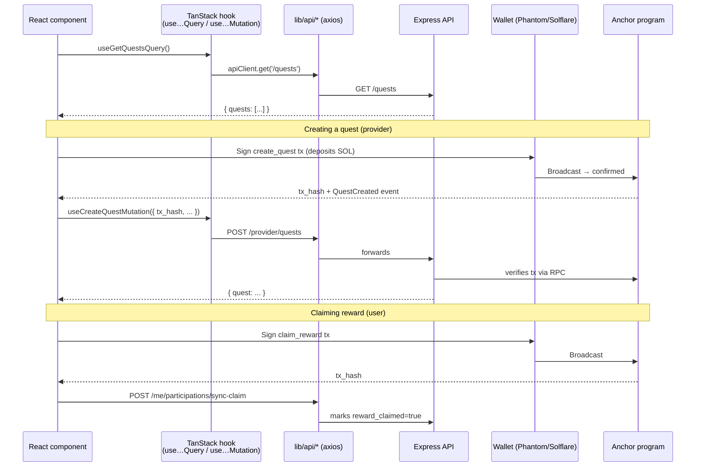

<div align="center">


# 🖥️ Frontend

### QuPilot's web UI — split-personality Next.js app for two very different audiences.

**Stack** · Next.js 16 (App Router) · React 19 · HeroUI · Tailwind v4 · TanStack Query · `@solana/web3.js` · `react-three-fiber` · `motion`

[← Back to root README](../README.md)

</div>

---

## What this app does

QuPilot has two completely different users:

- **Providers** (DeFi teams) want to *create* quests, deposit SOL, and watch analytics.
- **Users** want to *discover* quests, hand them to their agent, and claim SOL.

So the FE is one Next app with two route groups (`(provider)` and `(user)`), each with its own header, layout, and navigation. A public landing page sits in front of both.

---

## 📁 Folder layout

```
fe/
├── app/                         # Next.js App Router
│   ├── page.tsx                 # 🏠 Landing — 3D rocket hero + top quests/providers
│   ├── layout.tsx               # Root layout (providers, fonts, theme)
│   ├── providers.tsx            # HeroUI + TanStack QueryClient providers
│   ├── globals.css              # Tailwind v4 + brand vars
│   ├── components/
│   │   ├── AuthGate.tsx         # Wraps protected routes
│   │   └── AuthModal.tsx        # Unified wallet login/register modal
│   ├── skill/
│   │   └── page.tsx             # Hosted Claude Skill landing
│   ├── (provider)/
│   │   ├── layout.tsx           # Provider header: Dashboard + user menu
│   │   ├── dashboard/page.tsx   # Quest list + analytics
│   │   └── quests/
│   │       ├── new/page.tsx     # Create quest → deposit SOL → POST /provider/quests
│   │       ├── manage/          # Edit (currently 403 — quests are immutable)
│   │       └── [questId]/page.tsx
│   └── (user)/
│       ├── layout.tsx           # User header: Profile / Leaderboard / wallet pill
│       ├── explore/page.tsx     # Discovery feed
│       ├── profile/page.tsx     # Achievements + API key generator
│       ├── quests/page.tsx      # My participations
│       ├── quests/[questId]/page.tsx
│       └── leaderboard/page.tsx
├── lib/
│   ├── api/                     # apiClient wrappers per module
│   ├── hooks/                   # TanStack Query custom hooks
│   ├── schemas/                 # zod
│   ├── types/
│   ├── utils/
│   └── icons/
├── public/                      # static assets (3D models, og images)
├── config.ts                    # ALL env access goes through here
├── tailwind.config / postcss.config
└── package.json
```

---

## 🗺️ Route map

```mermaid
graph LR
    LP[🏠 / — Landing]

    subgraph PROV["(provider) — JWT role=user_provider"]
        PD[/dashboard]
        PN[/quests/new]
        PQ[/quests/:id]
        PM[/quests/manage]
    end

    subgraph USR["(user) — JWT role=user"]
        UE[/explore]
        UQ[/quests + /quests/:id]
        UL[/leaderboard]
        UPR[/profile<br/>+ API key]
    end

    SK[🤖 /skill — hosted Claude Skill]

    LP --> PROV
    LP --> USR
    LP --> SK
    UPR -. generates qpk_… for .-> SK

    style LP fill:#9945FF,color:#fff
    style PROV fill:#0070f3,color:#fff
    style USR fill:#14F195,color:#000
    style SK fill:#ef4444,color:#fff
```

Each route group has its own `layout.tsx` and auth boundary — providers can't see user pages and vice versa.

---

## 🎨 UX highlights

- **3D rocket hero** on the landing page (`react-three-fiber` + `@react-three/drei`) with `motion` cross-fade transitions — sets the "agent takes off, user relaxes" tone.
- **HeroUI everywhere.** Per the AGENTS.md convention: *prioritise HeroUI components over raw HTML.* Tables, modals, dropdowns, toasts — all HeroUI.
- **Unified `AuthModal`** handles both *user* and *provider* wallet login from one component, switching role based on entry point.
- **TanStack Query for everything:** 5min staleTime for master data, 30s for participation status. Mutations invalidate the right keys on `onSuccess`.
- **All env vars routed through `config.ts`.** Direct `process.env` access is forbidden by repo convention.

---

## 🔌 Data flow



---

## 🧬 Code conventions (from `AGENTS.md`)

These are **non-negotiable** for any PR:

- **File naming:** `ComponentName.tsx`, `useCamelCase.ts`, `camelCaseSlice.ts`
- **Types/interfaces:** `IPascalCase` or `TPascalCase`
- **Exports:** Named exports only.
- **CSS:** Tailwind utilities. Use `cn()` from `@heroui/react`. No `!important`.
- **Components:** Prefer HeroUI over raw HTML.
- **Env access:** Through `config.ts`, never `process.env` directly.
- **Validation:** Every input boundary uses Zod.
- **Imports:** `@/lib/...` or `@/components/...` aliases.
- **API services:** One folder per module under `lib/api/<module>/`.
- **Query keys:** `['module', 'list', filters]` or `['module', 'detail', id]`.
- **Error handling:** Mutations show toast with `error.response?.data?.message`. GETs retry on network/5xx (max 2). Never retry mutations.

---

## 🚀 Running locally

```bash
npm install
npm run dev       # → http://localhost:3000 (auto-shifts to :3001 if BE is on :3000)
npm run build
npm run lint
```

**Env vars** (configure via `.env.local`, accessed via `config.ts`):
```
NEXT_PUBLIC_API_URL=http://localhost:3000
NEXT_PUBLIC_SOLANA_RPC_URL=https://api.devnet.solana.com
NEXT_PUBLIC_QUPILOT_PROGRAM_ID=2auiCCwYy8pj6LpDnMomZRqKs49Gb5oRjtVkYDYRVmm3
```

---

## 🧭 Where to look next

| You want to… | Open… |
|---|---|
| Add a new page | `app/(provider)/...` or `app/(user)/...` (mind the layout + auth gate) |
| Add a new API call | `lib/api/<module>/api.ts` + matching hook in `lib/hooks/` |
| Wire a new TanStack hook | `lib/hooks/use<Module>Query.ts` — follow existing patterns |
| Understand the backend contract | [`../qupilot-be/API.md`](../qupilot-be/API.md) |
| Understand on-chain calls | [`../qupilot-anchor-program/README.md`](../qupilot-anchor-program/README.md) |
| Tweak the agent skill | [`../qupilot-agent-skills/README.md`](../qupilot-agent-skills/README.md) |

[← Back to root README](../README.md)
