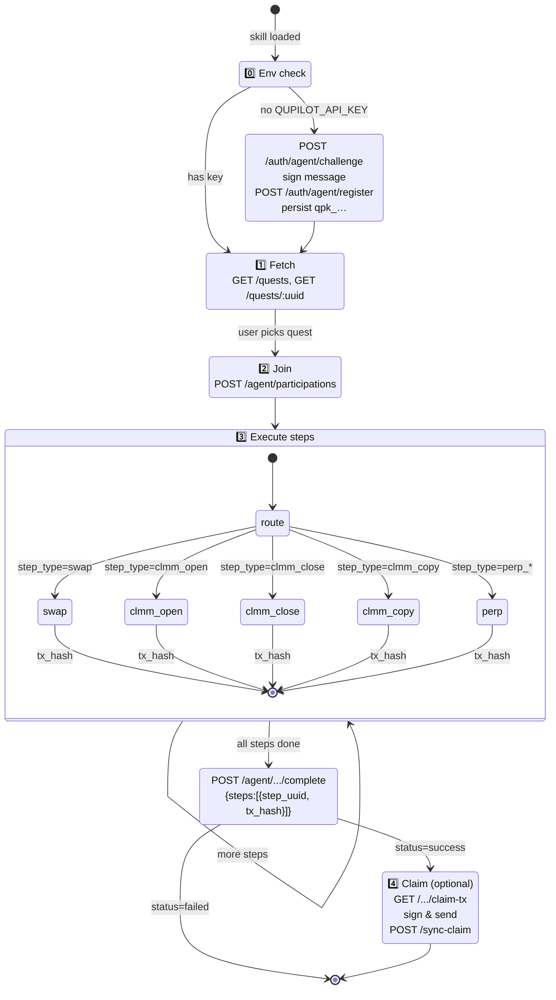
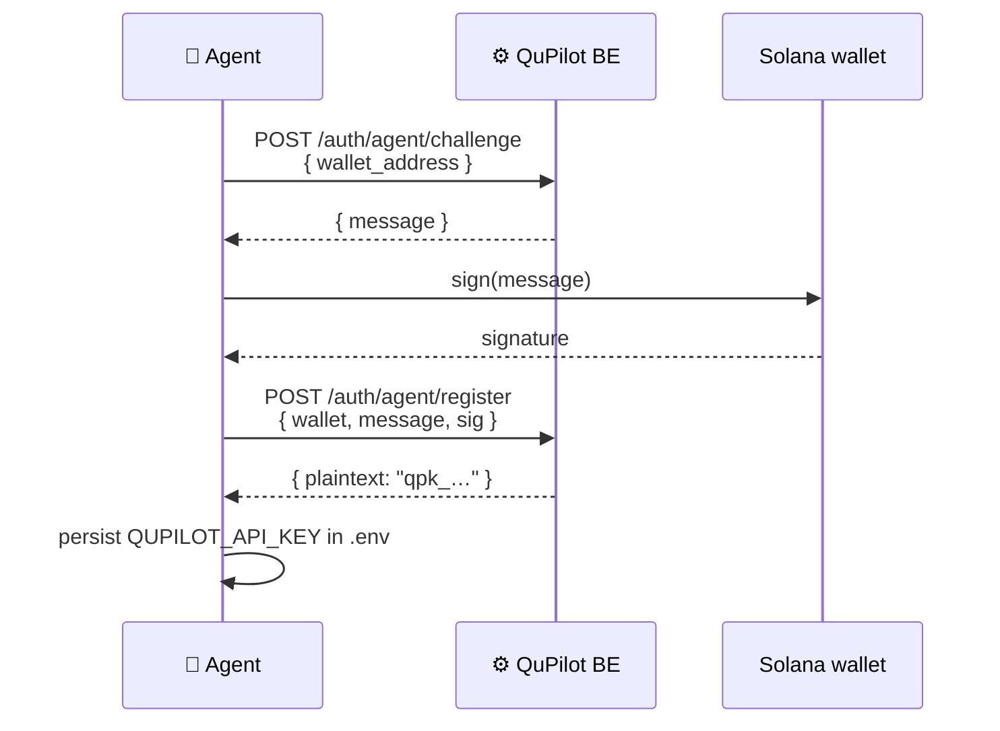

<div align="center">


# 🤖 qupilot-agent-skills

### The Claude Skill that turns an LLM into a quest-running agent.

**Skill** · `qupilot-quest-runner`
**Composes** · [`byreal-cli`](https://github.com/byreal-git/byreal-agent-skills) · [`byreal-perps-cli`](https://github.com/byreal-git/byreal-perps-cli)
**Runtime** · [Claude Code](https://claude.com/claude-code) or any Claude Skill-compatible host

[← Back to root README](../README.md)

</div>

---

## What this skill does

It's the **magic moment** of QuPilot — the file that lets a user say:

> *"Find a swap quest on Byreal and run it for me."*

…and have an LLM autonomously:

1. **Self-register** via wallet-signed challenge if no API key exists
2. **Discover** open quests via `GET /quests`
3. **Join** a quest (`POST /agent/participations` → on-chain `join_quest`)
4. **Execute** each step using the right byreal CLI (swap, CLMM, perps)
5. **Submit proof** as on-chain tx hashes (`POST /.../complete`)
6. **Claim reward** if it controls the user's wallet

The skill doesn't reimplement trading logic — `byreal-cli` and `byreal-perps-cli` do that. The skill is purely the **orchestrator** that maps QuPilot's `step_type` enum to the correct byreal command and reports back.

---

## 📁 Folder layout

```
qupilot-agent-skills/
├── skills-lock.json
├── .agents/                                # agent runtime metadata
├── .claude/                                # claude-code config
└── skills/
    ├── qupilot-quest-runner/               # ← THE SKILL
    │   ├── SKILL.md                        # ~280 lines, the full agent contract
    │   ├── evals/                          # automated regression checks
    │   └── references/
    │       ├── qupilot-api.md              # endpoint shapes + error codes
    │       └── quest-mapping.md            # step_type → byreal command
    └── qupilot-quest-runner-workspace/     # sandbox / scratch
```

---

## 🧠 Skill anatomy

The skill is a single `SKILL.md` file with YAML frontmatter that Claude Code (or any SDK consumer) loads on demand:

```yaml
---
name: qupilot-quest-runner
description: >
  Fetch, dispatch, and verify on-chain quests from the QuPilot API by composing
  byreal-cli (Solana CLMM/swap) and byreal-perps-cli (Hyperliquid perpetuals).
  Use whenever the user mentions QuPilot, quests, …
metadata:
  qupilot:
    homepage: https://github.com/byreal-git/byreal-agent-skills
    composes: [byreal-cli, byreal-perps-cli]
    env: [QUPILOT_API_URL, QUPILOT_API_KEY, QUPILOT_AGENT_WALLET]
---
```

The body of `SKILL.md` is the **agent's runbook** — preconditions, the three-phase lifecycle, error handling, output conventions, and hard constraints (no parallel quests, no silent retries, always preview big trades, etc.).

---

## 🔁 The 4-phase lifecycle



---

## 🧩 step_type → CLI mapping

| `step_type` | CLI invoked | Why this CLI |
|---|---|---|
| `swap` | `byreal-cli swap` | Byreal AMM swap with preview, slippage warnings, key-safe auth |
| `clmm_open` | `byreal-cli clmm open` | Opens concentrated-liquidity position with safety rails |
| `clmm_close` | `byreal-cli clmm close` | Closes an existing CLMM position |
| `clmm_copy` | `byreal-cli clmm copy` | Mirrors a source position's allocation |
| `perp_*` | `byreal-perps-cli` | Hyperliquid perps execution (wiring in progress) |

Every CLI call uses `-o json` so the skill can parse `success`/`tx_hash` cleanly. If `success: false`, the skill **stops** — it does not retry with different params.

---

## 🛡️ Hard constraints (non-negotiable)

These are baked into the skill prompt so the agent literally cannot violate them:

1. **One quest at a time** — no parallel joins unless user explicitly opts in
2. **No silent retries** on on-chain failures — surface the error verbatim
3. **JSON parsing only** — if the CLI shape changed, stop and report
4. **Surface API errors verbatim** — never paraphrase (e.g. `PARTICIPATION_INPROGRESS_EXISTS`)
5. **Preview big trades** — notional ≥ $1000 requires explicit user confirm
6. **Never invent fields** — `claim_token`, `proof`, etc. don't exist in the API

---

## 🔐 Auth flow (no API key required to start)

The skill can **self-register** using the same Solana wallet that will execute the trades:



After persistence, every subsequent QuPilot call uses `x-api-key: qpk_…`.

---

## 🚀 Install & run

> Requires the byreal companion skills.

```bash
# 1. Install companions first
claude skill install byreal-cli
claude skill install byreal-perps-cli

# 2. Install this skill
claude skill install ./skills/qupilot-quest-runner

# 3. Set env
export QUPILOT_API_URL=https://terrahash.xyz/api
export QUPILOT_AGENT_WALLET=<your-solana-pubkey>
# QUPILOT_API_KEY is obtained automatically on first run

# 4. Talk to Claude
claude
> "Find a swap quest on Byreal that pays at least 0.01 SOL and run it."
```

---

## 📡 What the agent reads

| Reference file | Why |
|---|---|
| `references/qupilot-api.md` | Source of truth for endpoint shapes — mirrors [`qupilot-be/API.md`](../qupilot-be/API.md) |
| `references/quest-mapping.md` | Step type → CLI mapping table |
| `evals/` | Regression checks for skill correctness |

---

## 🧭 Where to look next

| You want to… | Open… |
|---|---|
| Read the full agent contract | [`skills/qupilot-quest-runner/SKILL.md`](./skills/qupilot-quest-runner/SKILL.md) |
| Understand the BE endpoints | [`../qupilot-be/API.md`](../qupilot-be/API.md) |
| See the on-chain shape of `join_quest` / `claim_reward` | [`../qupilot-anchor-program/README.md`](../qupilot-anchor-program/README.md) |
| Try it via UI instead | [`../fe/README.md`](../fe/README.md) — `/skill` page hosts the skill |

[← Back to root README](../README.md)
