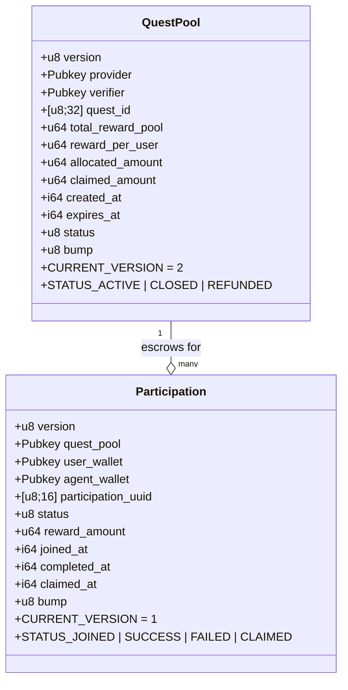
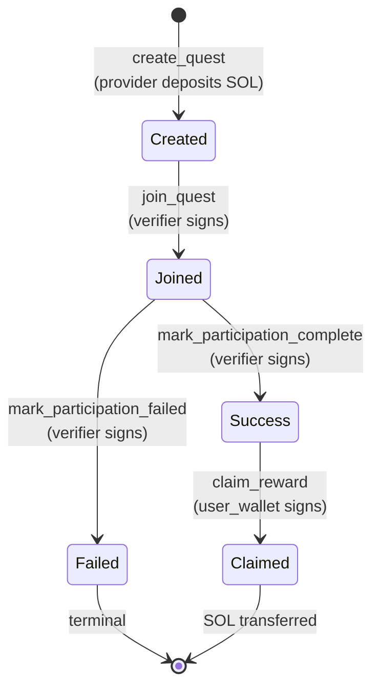

<div align="center">

# 📜 `qupilot-anchor-program`

### The on-chain escrow that makes QuPilot trustless.

**Program ID** · `2auiCCwYy8pj6LpDnMomZRqKs49Gb5oRjtVkYDYRVmm3`
**Framework** · Anchor 0.31.1
**Language** · Rust (Solana SVM)

[← Back to root README](../README.md)

</div>

---

## What this program does

A deliberately tiny escrow program — **no oracles, no admin keys, no upgrade authority drama**. It does four things and that's it:

1. **`create_quest`** — provider deposits SOL into a PDA pool, binding it to a `quest_id` (sha256 of the off-chain quest UUID) and a separate `verifier` pubkey.
2. **`join_quest`** — verifier (the BE signer) reserves a slot for a user, allocating `reward_per_user` from the pool.
3. **`mark_participation_complete` / `mark_participation_failed`** — verifier finalizes the participation after re-checking the agent's submitted tx hashes off-chain.
4. **`claim_reward`** — user (and only the user whose pubkey is baked into the participation PDA) withdraws their SOL.

Everything else — quest discovery, agent dispatch, tx parsing, leaderboard — lives off-chain in the [backend](../qupilot-be/README.md).

---

## 📁 Folder layout

```
qupilot-anchor-program/
├── Anchor.toml                # cluster config + program ID
├── Cargo.toml                 # workspace manifest
├── programs/qupilot/
│   ├── Cargo.toml
│   └── src/
│       ├── lib.rs             # #[program] entry, 5 instruction stubs
│       ├── state.rs           # QuestPool + Participation accounts
│       ├── errors.rs          # 11 program error codes
│       ├── events.rs          # 5 emitted events
│       └── instructions/
│           ├── create_quest.rs
│           ├── join_quest.rs
│           ├── mark_participation_complete.rs
│           ├── mark_participation_failed.rs
│           ├── claim_reward.rs
│           └── mod.rs
├── tests/                     # ts-mocha integration tests
├── migrations/                # Anchor deploy scripts
└── scripts/                   # one-off CLI helpers
```

---

## 🧱 Account model



**PDA seeds**
- `QuestPool`: `["quest", provider, quest_id]`
- `Participation`: `["participation", quest_pool, user_wallet]`

**Why two accounts?** Each user's claim is its own PDA. That makes them independently auditable and prevents double-spend by construction (the seed uses `user_wallet`).

---

## 🔁 Instruction flow



| Instruction | Signer | Side effects |
|---|---|---|
| `create_quest(quest_id, verifier, total, per_user, expires_at)` | provider | Inits `QuestPool` PDA, transfers `total` lamports into it, emits `QuestCreated` |
| `join_quest(participation_uuid, user_wallet, agent_wallet)` | **verifier** | Inits `Participation` PDA, increments `allocated_amount` by `reward_per_user`, emits `QuestJoined` |
| `mark_participation_complete()` | verifier | Flips participation → `SUCCESS`, sets `completed_at`, emits `ParticipationCompleted` |
| `mark_participation_failed()` | verifier | Flips participation → `FAILED`, decrements `allocated_amount` (slot returns to pool) |
| `claim_reward()` | user_wallet | Transfers `reward_amount` lamports pool → claimer, flips to `CLAIMED`, emits `RewardClaimed` |

---

## 🛡️ Security model

### 1. `verifier` ≠ `provider` (deliberate)
The `verifier` pubkey is captured at `create_quest` and is what `join_quest` / `mark_*` requires as signer. The BE holds the verifier key. **A malicious provider cannot mark their own participations complete to drain the pool.**

### 2. `claim_reward` is user-locked
```rust
#[account(mut, address = participation.user_wallet)]
pub claimer: Signer<'info>,
```
The participation PDA bakes in `user_wallet`. Only that pubkey can sign `claim_reward`. Even if the verifier key leaks, attacker cannot redirect funds.

### 3. Rent-exempt math on claim
Before transferring, we assert `pool_lamports >= rent_min + reward`. This protects the `QuestPool` account from being closed accidentally — keeping unclaimed participations claimable.

### 4. Allocation accounting prevents over-issue
```rust
let new_allocated = pool.allocated_amount.checked_add(pool.reward_per_user)?;
require!(new_allocated <= pool.total_reward_pool, RewardPoolExhausted);
```
The pool tracks `allocated_amount` (sum of joined participations × reward_per_user) so the Nth join can never exceed `total_reward_pool`.

### 5. All checked arithmetic
Every add/sub on lamport balances is `checked_*` and returns `InsufficientPoolLamports` on overflow.

### 6. Error code map
```rust
InvalidTotalReward | InvalidRewardPerUser | RewardPoolTooSmall
ExpiresAtInPast   | QuestNotActive       | QuestExpired
RewardPoolExhausted | InvalidParticipationStatus
RewardAmountMismatch | NotClaimable | InsufficientPoolLamports
```

---

## 📡 Emitted events (5)

| Event | Emitted by | Used by |
|---|---|---|
| `QuestCreated` | `create_quest` | BE parses tx to confirm `total_reward_pool` matches DB |
| `QuestJoined` | `join_quest` | BE writes `quest_pool_pda` + `participation_pda` to DB |
| `ParticipationCompleted` | `mark_complete` | BE bumps `quests.total_reward_distributed` |
| `ParticipationFailed` | `mark_failed` | BE updates status → `failed` |
| `RewardClaimed` | `claim_reward` | BE updates `reward_claimed=true` after `sync-claim` |

---

## 🧪 Build, test, deploy

```bash
# Build the program
anchor build

# Run integration tests (uses local validator)
anchor test

# Deploy to devnet
anchor deploy --provider.cluster devnet

# Deploy to mainnet (uses Anchor.toml [programs.mainnet])
anchor deploy --provider.cluster mainnet
```

**IDL upload (so the BE can decode events):**
```bash
anchor idl init -f target/idl/qupilot.json 2auiCCwYy8pj6LpDnMomZRqKs49Gb5oRjtVkYDYRVmm3
```

---

## 🔌 Integration points

| Consumer | How it talks to the program |
|---|---|
| [`qupilot-be/src/lib/solana.ts`](../qupilot-be/src/lib/solana.ts) | Holds the verifier keypair, builds `join_quest` / `mark_*` tx, parses `QuestCreated` from provider's deposit tx |
| [`fe/lib/`](../fe/README.md) | Builds `create_quest` tx (provider signs in wallet), builds `claim_reward` tx (user signs in wallet) |
| [`qupilot-agent-skills`](../qupilot-agent-skills/README.md) | Doesn't touch the program directly — talks only to the BE, which orchestrates on-chain calls |

---

## 🗺️ Quick reference

- **Program ID:** `2auiCCwYy8pj6LpDnMomZRqKs49Gb5oRjtVkYDYRVmm3`
- **Anchor version:** `0.31.1`
- **Cluster targets:** localnet, devnet, mainnet-beta (see `Anchor.toml`)
- **State version markers:** `QuestPool::CURRENT_VERSION = 2`, `Participation::CURRENT_VERSION = 1`

[← Back to root README](../README.md)
