<div align="center">

# ⚙️ `qupilot-be`

### The brain of QuPilot — Express API, tx verifier, and Anchor co-signer.

**Stack** · Express 5 + TypeScript + Supabase + `@coral-xyz/anchor` + `@solana/web3.js`
**Auth** · Wallet-signed JWT (user/provider) + bcrypt-hashed API keys (agent)

[← Back to root README](../README.md) · [📖 Full API reference →](./API.md)

</div>

---

## What this service does

The backend is the **single integration point** the FE and AI agents talk to. It handles three jobs:

1. **CRUD + auth** for quests, providers, users, agent API keys, participations, and the leaderboard.
2. **On-chain co-signer**: the BE holds the `verifier` keypair. When an agent says "I'm joining quest X for user Y", the BE builds the `join_quest` tx, signs it, and broadcasts.
3. **Tx hash verification**: when the agent submits step completion, the BE re-parses each tx against Solana RPC to assert signer / program / params match — this is the anti-cheat layer.

---

## 📁 Folder layout

```
qupilot-be/
├── API.md                     # ← full endpoint spec (start here)
├── EXECUTION_CHECKLIST.md     # ops/deploy checklist
├── quest-api-BE-requirements-v2.md
├── Dockerfile
├── .env.example
└── src/
    ├── app.ts                 # express app composition
    ├── index.ts               # bootstraps the server
    ├── config/
    │   ├── env.ts             # zod-validated env loader (use this, NOT process.env)
    │   └── supabase.ts        # supabase client singleton
    ├── lib/
    │   ├── solana.ts          # 17k LOC — RPC client, tx builders, event parsers
    │   ├── solana/            # IDL + helpers
    │   ├── jwt.ts             # JWT sign/verify
    │   ├── api-key.ts         # qpk_… generation + bcrypt
    │   ├── password.ts
    │   ├── wallet-signature.ts # tweetnacl Ed25519 verifier
    │   └── errors.ts          # AppError hierarchy
    ├── middlewares/
    │   ├── auth-user.ts       # Bearer JWT, role=user|user_provider
    │   ├── auth-provider.ts   # forces role=user_provider
    │   ├── auth-agent.ts      # x-api-key → resolves owner user
    │   ├── validate.ts        # zod request validator factory
    │   └── error-handler.ts   # central JSON error response
    ├── modules/               # ← one folder per domain
    │   ├── auth-user/         # wallet login (user + provider)
    │   ├── auth-agent/        # /auth/agent/challenge + /register
    │   ├── api-keys/          # qpk_… CRUD for users
    │   ├── providers/         # public provider directory
    │   ├── quests/            # quest creation + listing
    │   ├── participations/    # /me participations + claim sync
    │   ├── agent/             # /agent/* — the agent-facing surface
    │   └── leaderboard/       # ranked by reward + success rate
    └── types/
```

Each module follows the same shape:
```
modules/<name>/
├── <name>.routes.ts       # express.Router() — wires middleware
├── <name>.controller.ts   # req/res, no business logic
├── <name>.service.ts      # business logic, calls supabase + solana
└── <name>.schema.ts       # zod schemas (input validation)
```

---

## 🔀 Request flow

```mermaid
flowchart TB
    R[HTTP request] --> M{Middleware chain}
    M -->|"Bearer JWT"| AU[auth-user]
    M -->|"x-api-key"| AA[auth-agent]
    M -->|"public"| V[validate &#40;zod&#41;]
    AU --> V
    AA --> V
    V --> C[controller.ts]
    C --> S[service.ts]
    S -->|"DB"| DB[(Supabase)]
    S -->|"on-chain"| SOL[Solana RPC]
    S -->|"co-sign"| ANC[Anchor: build tx,<br/>sign with verifier]
    ANC --> SOL
    DB --> S
    SOL --> S
    S --> C
    C --> RES[JSON response]
    C -->|"throws AppError"| EH[error-handler.ts]
    EH --> RES

    style M fill:#1e293b,color:#fff
    style S fill:#10b981,color:#000
    style SOL fill:#9945FF,color:#fff
    style DB fill:#14F195,color:#000
```



---

## 🧩 Modules at a glance

| Module | Auth | Key endpoints | Notes |
|---|---|---|---|
| `auth-user` | public | `POST /auth/user/login` | First call returns `{registered:false}`, second registers + returns JWT |
| `auth-agent` | wallet sig | `POST /auth/agent/challenge`, `POST /auth/agent/register` | Self-onboards agent, returns `qpk_…` plaintext exactly once |
| `api-keys` | user JWT | `POST/GET/DELETE /me/api-key` | One active key per user; revocation rotates instantly |
| `providers` | public | `GET /providers`, `GET /providers/:uuid/quests` | Surfaces `spotlight` flag for FE highlights |
| `quests` | provider JWT + public reads | `POST /provider/quests`, `GET /quests`, `GET /public/highlights` | Verifies the deposit tx hash before persisting |
| `participations` | user JWT | `GET /me/participations`, `POST /me/participations/sync-claim` | Reads-only for users; sync-claim ack's a user-broadcast claim |
| `agent` | `x-api-key` | `POST /agent/participations`, `POST /agent/participations/:uuid/complete`, `GET /agent/me/stats`, `GET /.../claim-tx` | The whole agent loop lives here |
| `leaderboard` | public | `GET /leaderboard` | Sums `quests.reward_per_user` where `participation.status=success AND reward_claimed=true` |

---

## ⛓️ The tx-verification core (`lib/solana.ts`)

This is the **non-bypassable anti-cheat layer**. When the agent submits a step's `tx_hash`, the BE does (in order):

```mermaid
flowchart LR
    A[tx_hash from agent] --> B[getTransaction&#40;hash&#41;<br/>via RPC]
    B --> C{confirmed?}
    C -->|no| RETRY[mark retryable<br/>+ short backoff]
    C -->|yes| D[decode instructions]
    D --> E{matches step.step_type?}
    E -->|swap| F[assert signer = agent_wallet<br/>+ program = AMM<br/>+ from/to mints match]
    E -->|clmm_*| G[assert pool + position pubkey match]
    E -->|clmm_copy| H[assert source_position + amount_usd]
    F & G & H --> OK[✅ step verified]
    E -->|mismatch| FAIL[❌ step.status=failed]
```



Notes:
- **Retryable failures** (RPC timeout, blockhash not yet confirmed) do NOT burn the participation — the agent can re-submit. See commit `f391e1b` (*"make step verification retryable"*).
- **`action_params` enforcement**: BE re-decodes the on-chain instruction data and compares to the quest's stored `action_params`. If a swap quest says USDC→USDT but the tx is USDC→SOL, it fails.

---

## 🔐 Auth model in one diagram

```mermaid
flowchart TB
    subgraph WALLET["Wallet signing"]
        W1[User opens FE] --> W2[Sign message<br/>with Solana wallet]
        W2 --> W3[POST /auth/user/login<br/>{wallet, sig, msg}]
        W3 --> W4[BE verifies via tweetnacl]
        W4 --> W5[BE issues JWT]
    end

    subgraph AGENT["Agent API key"]
        A1[Agent runs<br/>POST /auth/agent/challenge]
        A1 --> A2[Receives random message]
        A2 --> A3[Signs with Solana wallet]
        A3 --> A4[POST /auth/agent/register<br/>{wallet, sig, msg}]
        A4 --> A5[BE returns qpk_…<br/>plaintext ONCE]
        A5 --> A6[BE stores bcrypt&#40;secret&#41;<br/>+ key_prefix only]
    end

    subgraph USE["Subsequent calls"]
        W5 --> U1[Authorization: Bearer JWT]
        A5 --> U2[x-api-key: qpk_…]
    end

    style WALLET fill:#9945FF,color:#fff
    style AGENT fill:#0070f3,color:#fff
    style USE fill:#10b981,color:#000
```

Why API keys for agents? An LLM-driven agent can't pop a wallet modal mid-session. The wallet-signed challenge → API key flow lets the agent prove ownership *once*, then operate headlessly.

---

## 🚀 Running locally

```bash
cp .env.example .env
# Fill in:
#   SUPABASE_URL, SUPABASE_SERVICE_ROLE_KEY
#   SOLANA_RPC_URL (devnet or mainnet)
#   VERIFIER_KEYPAIR_BASE58 (the on-chain verifier signer)
#   JWT_SECRET
#   QUPILOT_PROGRAM_ID=2auiCCwYy8pj6LpDnMomZRqKs49Gb5oRjtVkYDYRVmm3

npm install
npm run dev        # → http://localhost:3000 (tsx watch)
npm run typecheck  # CI gate
npm run build      # tsc → dist/
npm run start      # production
```

**Docker:**
```bash
docker build -t qupilot-be .
docker run --env-file .env -p 3000:3000 qupilot-be
```

---

## 🩺 Error contract

All errors come out as:
```json
{ "error": { "code": "SOME_CODE", "message": "Human readable" } }
```

Zod validation adds `issues[]`:
```json
{ "error": { "code": "VALIDATION_ERROR", "message": "...", "issues": [{ "path": "...", "message": "..." }] } }
```

The `error-handler.ts` middleware is the single funnel — controllers `throw new AppError(...)` and never write directly to `res`.

---

## 🔌 Where to look next

- **Full endpoint reference** → [`API.md`](./API.md)
- **Deploy/ops checklist** → [`EXECUTION_CHECKLIST.md`](./EXECUTION_CHECKLIST.md)
- **On-chain program** → [`../qupilot-anchor-program/README.md`](../qupilot-anchor-program/README.md)
- **Frontend consumer** → [`../fe/README.md`](../fe/README.md)
- **Agent consumer** → [`../qupilot-agent-skills/README.md`](../qupilot-agent-skills/README.md)

[← Back to root README](../README.md)
